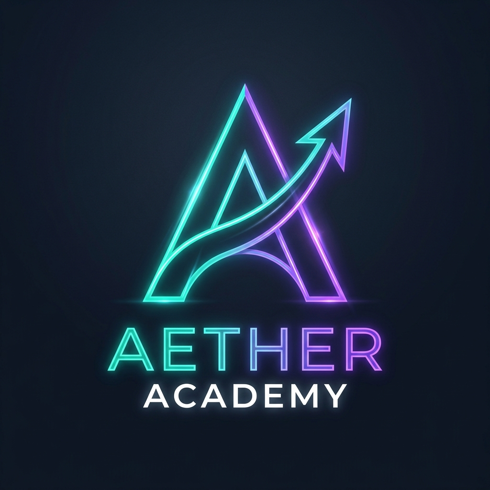

# Aether Academy 🎓

**Aether Academy** is a modern, responsive, and secure Student Management System (LMS) built with procedural PHP, MySQL, and Bootstrap 5. 

## 🚀 Key Features
* **Dual Dashboards:** Secure, isolated dashboard views for both Admins and Students with live metric calculations.
* **Modern "Night Owl" UI:** A deeply customized, slate-dark Bootstrap 5 glassmorphism theme with neon accents.
* **Course & Enrollment Management:** Admins can create courses, and students can dynamically view their enrolled curriculums in a responsive card grid.
* **Advanced Attendance Tracking:** Complete attendance module featuring percentage calculation, automated absent/present routing, and idle-session timeout security.
* **Database Security:** Bcrypt password hashing, prepared SQL query defense, and session hijack prevention.

## 🛠️ Tech Stack
* **Frontend:** HTML5, CSS3, JavaScript, jQuery, Bootstrap 5, FontAwesome
* **Backend:** PHP 8, MySQLi
* **Database:** MySQL (Relational Schema)
* **Design Pattern:** Procedural, Modular component injection

## 🔐 Architecture & Authorship
Architected and developed solely by **Uday Praveen** (PRN: 23030124196) at Symbiosis Institute of Computer Studies and Research (SICSR), Pune.

## 📄 License
This project is licensed under the MIT License - see the [LICENSE](LICENSE) file for details. Unauthorized commercial reproduction without explicit credit is prohibited.
